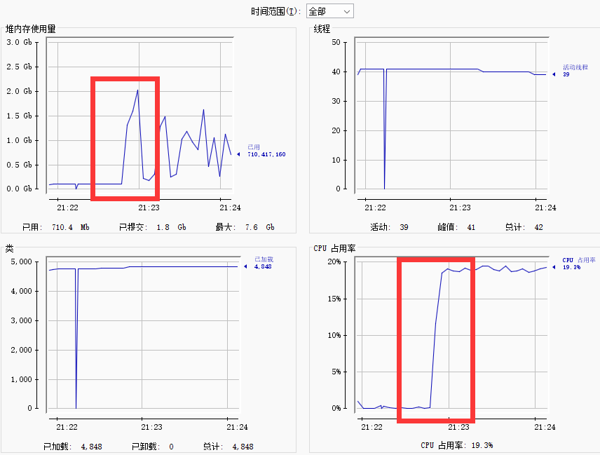

# CVE-2022-29885

**The tool is only used for security research. It is prohibited to use the tool to launch illegal attacks, and the user is responsible for the consequences**

**工具仅用于安全研究以及内部自查，禁止使用工具发起非法攻击，造成的后果使用者负责**

## Introduce

Apache Tomcat DoS (CVE-2022-29885) Exploit

Denial of Service in EncryptInterceptor (Tomcat Cluster)

The target machine needs to start the Cluster Nio Receiver,Sending a special TCP packet will cause a Denial of Service to the target. Whether `EncryptInterceptor` is used or not, there is the possibility of denial of service vulnerability

Condition: Enable tomcat cluster function and use `NioReceiver` for communication

**Any version of Tomcat will be affected. The only solution is to use a trusted network**

## Unsafe Config Exploit

Unsafe config: not use EncryptInterceptor

server.xml
```xml
<Cluster className="org.apache.catalina.ha.tcp.SimpleTcpCluster">
  <Channel className="org.apache.catalina.tribes.group.GroupChannel">
    <Receiver className="org.apache.catalina.tribes.transport.nio.NioReceiver"
      address="0.0.0.0"
      port="5000"
      selectorTimeout="100"
      maxThreads="6"/>
  </Channel>
</Cluster>
```

exploit: `./dos -h target_ip -p target_nio_port`



**In unsafe config, you can use Safe-Config-Exploit as well**

**But in safe config, you can only use Safe-Config-Exploit**

## Safe Config Exploit

Safe config: use EncryptInterceptor

server.xml
```xml
<Cluster className="org.apache.catalina.ha.tcp.SimpleTcpCluster">
  <Channel className="org.apache.catalina.tribes.group.GroupChannel">
    <Receiver className="org.apache.catalina.tribes.transport.nio.NioReceiver"
      address="0.0.0.0"
      port="5000"
      selectorTimeout="100"
      maxThreads="6"/>
    <Interceptor className="org.apache.catalina.tribes.group.interceptors.EncryptInterceptor"
       encryptionAlgorithm="AES/CBC/PKCS5Padding"
       encryptionKey="ANY_KEY(LENGTH:32)"/>
  </Channel>
</Cluster>
```

exploit: `./dos -h target_ip -p target_nio_port -s`


## Reference

https://lists.apache.org/thread/2b4qmhbcyqvc7dyfpjyx54c03x65vhcv
